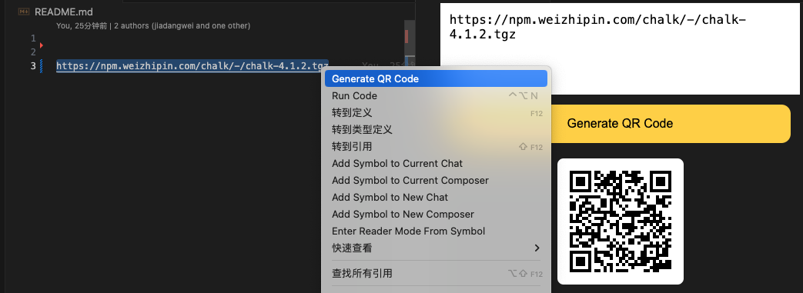

## Usage

Select a text and right-click to choose `Generate QR Code`, then you can see the QR code in the panel. And you can `copy` the QR code to the clipboard by clicking the QR code.



Or hit `shift + command + p` to execute the command `Generate QR Code`.


You can also set the default QRCode URL in the `settings.json` file.

```json
{
  "QRCodeGenerator.DefaultQRCodeUrl": "https://www.baidu.com"
}
```

## Contact me

If you have any questions or suggestions, please feel free to contact me.

- Email: coderwsh@gmail.com
- WeChat: `Java770880`
